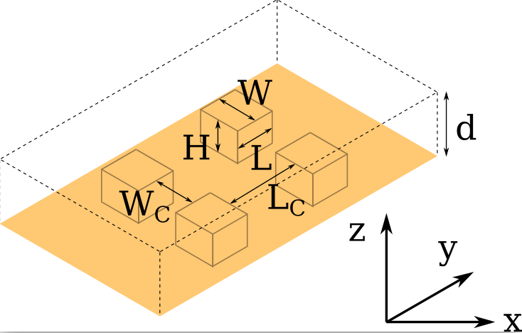
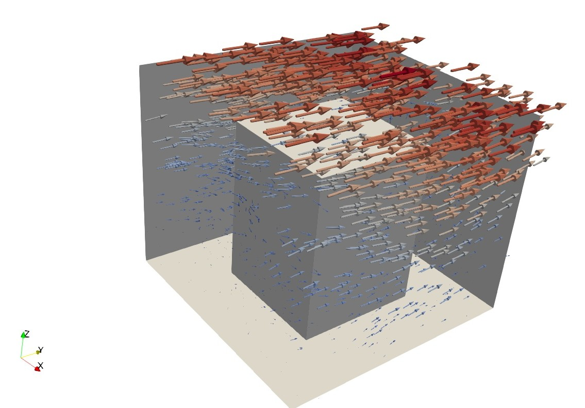

# MMFT Fuel Cell

The Microfluidic Fuel Cell (MFFC) simulator is developed by the [Chair for Design Automation](https://www.cda.cit.tum.de/) at the [Technical University of Munich](https://www.tum.de/), as part of the Munich MicroFluidic Toolkit (MMFT). This simulator models the hydrogen transport in a liquid electrolyte for microfluidic applications on anode surfaces with _nanostructures_. More details about the implementation can be found in:

[[1]](https://www.cda.cit.tum.de/files/eda/2022_microtas_improved_performance_of_two_phase_microfluidic_fuel_cells_using_nanostructures.pdf) Takken, Michel and Wille, Robert. Improved Performance of Membraneless Microfluidic Fuel Cells Using Nanostructures: A Numerical Study. MicroTAS, 2022.

The simulation is based on the Navier-Stokes equations with the advection-diffusion equation, and is solved with the lattice Boltzmann method (LBM). The LBM solver used is the Parallel Lattice Boltzmann Solver: [Palabos](https://palabos.unige.ch/) v2.3.0.

[[2]](https://doi.org/10.1016/j.camwa.2020.03.022)  Latt, Jonas, et al. Palabos: parallel lattice Boltzmann solver. Computers & Mathematics with Applications, 2021.

For more information about our work on Microfluidics, please visit [https://www.cda.cit.tum.de/research/microfluidics/]( https://www.cda.cit.tum.de/research/microfluidics/).

If you have any questions, feel free to contact us via [microfluidics.cda@xcit.tum.de](microfluidics.cda@xcit.tum.de) or by creating an issue on GitHub.

## System Requirements
This repository has been tested and works for Ubuntu 20.6. Minimal system requirements are:

* Palabos v2.3.0
* CMake version 2.8.12
* MPI version 4.1
* Python 3.10

## Usage


#### Install Palabos as the fluid solver
Install the latest version of Palabos [here](https://gitlab.com/unigespc/palabos), for more info see [https://palabos.unige.ch/](https://palabos.unige.ch/).

In `AdvectionDiffusion/CMakeLists.txt` specify the location of your palabos library

```
###############################################################################
# Palabos Library
###############################################################################

include_directories("pathToPalabos/src")
include_directories("pathToPalabos/externalLibraries")
include_directories("pathToPalabos/externalLibraries/Eigen3")

file(GLOB_RECURSE PALABOS_SRC "pathToPalabos/src/*.cpp")
file(GLOB_RECURSE EXT_SRC "pathToPalabos/externalLibraries/tinyxml/*.cpp")
```

then go to `build/` and do the following commands

`cmake ..`

`make`

After the executable is created in `AdvectionDiffusion/` you can do a test run with

`./run.sh 1 50`

to do a test run on cubic nanostructures, where 1 is the number of processors, and 50 the amount of cells in the z direction.

#### Geometry generation

To generate a shape with dimensions, use

`python3 ChannelGenerator.py`

The available shapes are

* cube
* Step
* Groove
* Offset (for the offset cubes)

The dimensions of the elements are given by the following variables, and can be set in `ChannelGenerator.py`



Please note that for steps the channel width is 0, and for grooves, the channel length is 0. For offset cubes, choose channel width 0, to have an offset that is equal to the cube width.

## Example

For a cube with channel width and length 300 nanometers, width and length 300 nanometers, andheight 400 nanometers, the resulting flow velocity field is shown below. The effective flux for this nanostructure is 780% better than for a flat surface, whereas the total surface is increased by 130%.



## References
[[1]](https://www.cda.cit.tum.de/files/eda/2022_microtas_improved_performance_of_two_phase_microfluidic_fuel_cells_using_nanostructures.pdf) Takken, Michel and Wille, Robert. Improved Performance of Membraneless Microfluidic Fuel Cells Using Nanostructures: A Numerical Study. MicroTAS, 2022.

[[2]](https://doi.org/10.1016/j.camwa.2020.03.022)  Latt, Jonas, et al. Palabos: parallel lattice Boltzmann solver. Computers & Mathematics with Applications, 2021.

[[3]](https://doi.org/10.1016/j.jpowsour.2017.02.079) Hashemi, S. M. H., et al. Membrane-less micro fuel cell based on two-phase flow. Journal of Power Sources, 2017.
